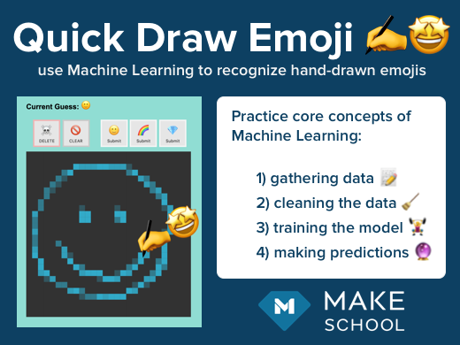

<!--  TODO-->

<!--  TODO-->

This tutorial is a beginner-friendly introduction to the basics of Machine Learning.

At the very end of the tutorial are additional challenges, for both beginners and advanced learners, to push your programming skills even further.

## Navigating the Tutorial

### Learning

Along the way, important information will be highlighted in an...

> [info]
> information box

### Doing

Any time you need to add some code or complete and important step, you'll find it in an...

> [action]
> action box

### Checking

After you've come up with your own answer, you can expand the...

> [solution]
> solution box

### Growing

Along the way and at the end of the tutorial, you can push yourself by tackling all of the...

> [challenge]
> challenges in boxes like this

## What You'll Learn

> [info]
>Along the way you’ll get hands-on practice with core concepts of Machine Learning:
>
> - 1) gathering data 📝
> - 2) cleaning and formatting the data 🧹
> - 3) training the model 🏋️‍♀️
> - 4) using the trained model to make predictions 🔮

By the end, you'll have your own live interactive Machine Learning website that you can show off to friends and family.

<!--  TODO -->

# Accessing the Starter Project

Where will you actually write the code? There are two options for getting the starter project.

## Best Option - Use repl.it

Repl.it is a website makes it easy to jump right in to programming without having to set up a local environment. Whether you are a beginning or advanced programmer, it's a great way to jump right into the code.

> [action]
> In a new window, go to [QuickDrawEmojiTutorial on Repl.it](https://repl.it/@MakeSchoolRAMP/QuickDrawEmojiTutorial)

<!-- ### Repl.it Interface Overview -->

<!-- TODO: Screenshot and overview of navigating repl.it project -->

## Alternate Option - Use GitHub

This tutorial does not cover working with GitHub or getting set up for local development of web projects, but if those are things you are already comfortable with, you can clone the starter project from GitHub.

> [action]
> In a new window, go to [Quick-Draw-Emoji-Starter on GitHub](https://github.com/MakeSchool-Tutorials/Quick-Draw-Emoji-Starter)

# Project Introduction

When you first run the program you should see that right now it just has a simple webpage with a drawing canvas and a clear button. This will be where you'll draw the emojis that you want to train and make predictions from.

Try it out now - you can draw on and clear the canvas as much as you want.

<!-- TODO: image of starter page -->

When viewing the starter project, you should see the following file structure:

```
main.py
/app
   /static
       sketch.js
       style.css
   /templates
      base.html
      index.html
   __init__.py
   model.py
   routes.py
requirements.txt
samples.txt
```

All of the work you'll do in this tutorial will be inside of `app/model.py` and require only a basic familiarity with programming to complete the project and gain an initial understanding of Machine Learning. Even if you are not already familiar with Python, the syntax will be easy to pick up as you go.

The full program consists of a Flask Python server as the backend, an interactive drawing canvas using JavaScript and the p5.js library, and the sklean Python library for the Machine Learning functionality. More experienced programmers can dive into those parts of code in the stretch challenges at the end of the tuturial.

## `app/model.py`

```python
### IMPORT HELPERS ###
import json
from sklearn import tree

### CUSTOM DISPLAY VARIABLES ###
# TODO: add global display variables here

### MACHINE LEARNING MODEL VARIABLES ###
# TODO: add machine learning variables here

### DATA COLLECTION ###
# TODO: add the collect_sample(data) function here

# TODO: add the save_sample(data) function here

# TODO: add the delete_samples() function here

### DATA FORMATTING ###
# TODO: add the load_training_data() function here

# TODO: add the flatten_list(list_2d) function here

#### MODEL TRAINING ###
# TODO: add the update_training() function here

### MODEL PREDICTION ###
# TODO: add the predict(data) function here
```

`model.py` is where you'll be making all of the changes for this tutorial. The initial imports are provided at the top and you will add all of the other important code yourself.

Other files are briefly explained below for those who are interested in a deeper understanding of the overall program structure, but optional for the purpose of this tutorial. The rest of the project is already setup to correctly import and use the logic that you'll be adding here.

## `main.py`

```python
from app import app

if __name__ == '__main__':
  app.run(host='0.0.0.0', port=8080)
```

The first line loads in the files from the `/app` folder.

The `if` statement checks if this is the main file, and if so, calls `app.run` which then calls `app/__init__.py`.


## `app/static` and `app/templates`

These folders contain the HTML, CSS, and JavaScript code that handles the visual display and user interactions of the website.

## `app/__init__.py`

```python
from flask import Flask
app = Flask(__name__)

from app import routes
```
This code imports the Flask library, creates a new Flask server instance, and then imports the routes (from `routes.py`).

## `app/routes.py`

```python
from flask import request, render_template, jsonify
from app import app
from app.model import * # import all of the variables and functions from model.py

# ... file continues
```

This file defines the urls that can be accessed and defines what is returned to be viewed by the browser.

The top of the file imports helper functions from the Flask library. The second line loads the app folder so that line 3 can access the contents of `app/model.py` and load all of the code within it.


## `requirements.txt`

```
Flask==1.0.2
sklearn==0.0
```

These tell the program which version numbers to use when importing the python libraries.

## `samples.txt`

Starts out as a totally empty file. This is where the data submitted by the user will be stored. Then the data will be loaded, formatted, and used to train the Machine Learning model.

# Add Your Name

You're about to build out an awesome Machine Learning project that you can share with friends and family - let's be sure to put your name on it!

> [action]
> 1. Inside of `model.py` find where it says `# TODO: add global display variables here`
> 1. Add a global variable called `created_by` and set it equal to your name: `created_by = "YOURNAME"`

## Check

Re-run the program and see that your name now appears at the top.

<!-- TODO: image of name added -->

PS - Don't worry, we'll be adding custom CSS later to improve the overall style of the webpage :)
