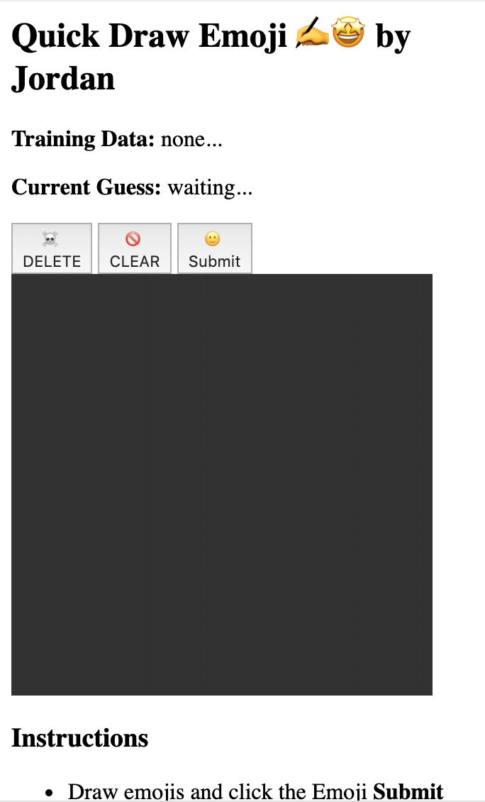

An essential part of doing Machine Learning is that you first need some data, something that you can feed to a model for it to actually learn from.

In Machine Learning, the 2 pieces of data that we need are **labels** and **features**.

> [info]
>
> - **Labels** are the names or result types you want your Machine Learning model to be able to predict: such as animal species ("bird" or "insect"), what to wear ("shorts", "sweater", or "rain jacket"), and so on
> - **Features** are the other information you have that you want the Machine Learning model to learn about and associate with labels: such as physical properties ("can fly", "number of eyes", "weight"), weather data ("amount of rain", "temperature", "time of year") , or many other things
>

In this project, the labels we'll be using are emoji and the features we'll train the model with are the canvas drawings.

Time to add a way for the user to indicate which emoji (**label**) they are drawing on the canvas.

> [action]
> On a new line under where you added `created_by`, add a new global variable called `learn_emoji` and set it equal to an array with a single string inside of it, with the emoji of your choice.
> Example: `learn_emoji = ["🙂"]`
>

## Check

Run the app again and you'll see that the display has changed. There's now a "Submit" button for the emoji you chose and places to display information about the *Training Data* and *Current Guess*.



# Saving Samples

If you click the *Submit* button right now nothing happens. We need to add some logic that takes the submitted data and stores it for later use so that we can train the model with it.

When the user clicks a "submit" button, it sends a **POST** request to the `/train` endpoint passing in the emoji (**label**) and a 2D array (an array of arrays) representing the values of the grid on the canvas (**features**). The `/train` endpoint then tries to send the data through to a function called `save_sample(data)` - let's implement that function now.

> [action]
>
> In `model.py`, find where it says `# TODO: add the save_sample(data) function here`, and on a new line underneath, add the following code:
>
>```python
> def save_sample(data):
>   if "label" in data.keys() and "features" in data.keys():
>     sample = {"label": data["label"], "features":data["features"]}
>     data_string = json.dumps(sample)
>     text = open("samples.txt","a+")
>     text.write(f'{data_string}\n')
>     text.close()
>     return True
>```
>

The `if` statement checks first that we are getting the `label` and `features` information that we need, then creates a dictionary with just those two piece of information (to avoid storing other infomation in the JSON request that we don't want to use for training). That dictionary is converted to a string (`data_string`).

Next it opens the `samples.txt` file in **append** mode (`a+`), adds `data_string` on a new line, closes `samples.txt`, and then returns `True` to indicate that the save was a success.

## Check

1. Re-run the program.
1. Draw your emoji.
1. Press "Submit".

Click into the `samples.txt` and confirm that there is now a line of info that looks similar to this:

```
{"label": "\ud83d\ude42", "features": [[0, 0, 0, 0, 0, 0, 0, 0, 0, 0, 0, 0, 0, 0, 0, 0, 0, 0, 0, 0, 0, 0, 0, 0, 0, 0, 0, 0], [0, 0, 0, 0, 0, 0, 0, 0, 0, 0, 0, 0, 0, 0, 0, 0, 0, 0, 0, 0, 0, 0, 0, 0, 0, 0, 0, 0], [0, 0, 0, 0, 0, 0, 0, 0, 0, 0, 0, 0, 0, 0, 0, 0, 0, 0, 0, 0, 0, 0, 0, 0, 0, 0, 0, 0], [0, 0, 0, 0, 0, 0, 0, 0, 0, 0, 0, 0, 0.3, 0.6, 0.9, 0.6, 0.6, 0.6, 0, 0, 0, 0, 0, 0, 0, 0, 0, 0], [0, 0, 0, 0, 0, 0, 0, 0, 0.6, 0.6, 0.6, 0.9, 0.3, 0, 0, 0, 0, 0.3, 0.6, 0.9, 0.3, 0, 0, 0, 0, 0, 0, 0], [0, 0, 0, 0, 0, 0, 0.6, 0.6, 0.3, 0, 0, 0, 0, 0, 0, 0, 0, 0, 0, 0, 0.6, 1, 0, 0, 0, 0, 0, 0], [0, 0, 0, 0, 0, 0.6, 0.3, 0, 0, 0, 0, 0, 0, 0, 0, 0, 0, 0, 0, 0, 0, 0.3, 1, 0.3, 0, 0, 0, 0], [0, 0, 0, 0, 0.6, 0.3, 0, 0, 0, 0, 0, 0, 0, 0, 0, 0.3, 0.6, 0, 0, 0, 0, 0, 0, 1, 0, 0, 0, 0], [0, 0, 0, 0.6, 0.3, 0, 0, 0, 0, 0, 0, 0, 0, 0, 0, 0, 0.9, 1, 0, 0, 0, 0, 0, 0, 1, 0, 0, 0], [0, 0, 0, 0.6, 0, 0, 0, 0, 0, 0, 0, 0, 0, 0, 0, 0, 0, 0, 1, 0, 0, 0, 0, 0, 0.6, 0.6, 0, 0], [0, 0, 0.3, 0.3, 0, 0, 0, 0, 0, 0, 0, 0, 0, 0, 0, 0, 0, 0, 0.3, 0.9, 0, 0, 0, 0, 0, 0.9, 0, 0], [0, 0.9, 0.9, 0, 0, 0, 0, 0, 0, 0, 1, 0.9, 0, 0, 0, 0, 0, 0, 0, 0.6, 0, 0, 0, 0, 0, 0.9, 0, 0], [0, 0.6, 1, 0, 0, 0, 0, 0, 0, 0, 0, 1, 0, 0, 0, 0, 0, 0, 0, 0.3, 0.3, 0, 0, 0, 0, 0, 0.6, 0], [0, 0.6, 0.6, 0, 0, 0, 0, 0, 0, 0, 0, 0, 0, 0, 0, 0, 0, 0, 0, 0, 0.6, 0, 0, 0, 0, 0, 0.6, 0], [0, 0.6, 0, 0, 0, 0, 0, 0, 0, 0, 0, 0, 0, 0, 0, 0, 0, 0, 0, 0, 0.9, 0, 0, 0, 0, 0, 0.6, 0], [0, 0.9, 0, 0, 0, 0, 0, 0, 0, 0, 0.3, 0, 0, 0, 0, 0, 0, 0, 0, 0, 0.6, 0, 0, 0, 0, 0, 0.6, 0], [0, 0.9, 0, 0, 0, 0, 0, 0, 0, 0, 1, 1, 0, 0, 0, 0, 0, 0, 0, 0, 1, 0, 0, 0, 0, 0, 0.3, 0], [0, 0.6, 0, 0, 0, 0, 0, 0, 0, 0, 0, 0, 0, 0, 0, 0, 0, 0, 0, 0, 0.9, 0, 0, 0, 0, 0, 0.6, 0], [0, 0.6, 0, 0, 0, 0, 0, 0, 0, 0, 0, 0, 0, 0, 0, 0, 0, 0, 0, 0, 0.9, 0, 0, 0, 0, 0.3, 0, 0], [0, 0.6, 0.6, 0, 0, 0, 0, 0, 0, 0, 0, 0, 0, 0, 0, 0, 0, 0, 0, 0.3, 1, 0, 0, 0, 0, 0.6, 0, 0], [0, 0, 0.9, 0, 0, 0, 0, 0, 0, 0, 0, 0, 0, 0, 0, 0, 0, 0, 0, 1, 0, 0, 0, 0, 0, 0.6, 0, 0], [0, 0, 0.9, 0.3, 0, 0, 0, 0, 0, 0, 0, 0, 0, 0, 0, 0, 0.6, 1, 1, 0, 0, 0, 0, 0, 0.9, 0, 0, 0], [0, 0, 0, 0.9, 0, 0, 0, 0, 0, 0, 0, 0, 0, 0, 0, 0, 0, 0, 0, 0, 0, 0, 0, 0.9, 0, 0, 0, 0], [0, 0, 0, 0.3, 0.9, 0, 0, 0, 0, 0, 0, 0, 0, 0, 0, 0, 0, 0, 0, 0, 0, 0.3, 0.6, 0.3, 0, 0, 0, 0], [0, 0, 0, 0, 0, 0.9, 0.3, 0, 0, 0, 0, 0, 0, 0, 0, 0, 0, 0, 0, 0, 0.9, 0.6, 0, 0, 0, 0, 0, 0], [0, 0, 0, 0, 0, 0, 0.6, 0.6, 0, 0, 0, 0, 0, 0, 0, 0, 0, 0, 0.6, 0.6, 0, 0, 0, 0, 0, 0, 0, 0], [0, 0, 0, 0, 0, 0, 0, 0.3, 0.3, 0.6, 0, 0, 0, 0, 0, 0.9, 0.3, 0.9, 0, 0, 0, 0, 0, 0, 0, 0, 0, 0], [0, 0, 0, 0, 0, 0, 0, 0, 0, 0, 0.6, 0.6, 0.9, 0.6, 0.9, 0, 0, 0, 0, 0, 0, 0, 0, 0, 0, 0, 0, 0]]}
```

The values in the array represent how filled in each square of the canvas is - 0 is empty (black) and 1 is fully filled in (teal), and partial fill are decimal values in-between.

Create and submit a few more drawings and confirm that a new line is added to `samples.txt` each time.

> [info]
> The helper `json.dumps` converts emojis into unicode so that they can be stored as pure strings. So 🙂 becomes `\ud83d\ude42`. Later on you'll also use the helper `json.loads` to convert them back to emojis.

# Deleting Samples

What if you want to delete all the data and start the Machine Learning over from scratch?

Now that you know where the data is being saved, you can manually remove some or all of the data by simply deleting lines from `samples.txt`. Try deleting some or all of your saved data and using the web interface to draw and submit new data.

But as a website user, if you press the "Delete" button right now nothing happens. Let's fix that.

> [action]
>
> In `model.py`, find where it says `# TODO: add the delete_samples() function here`, and on a new line underneath, add the following code:
>
>```python
> def delete_samples():
>   open("samples.txt", "w").close()
>   return True
>```
>

This simple function opens `samples.txt` in **write** mode (`w`) and then immediately closes it, which has the effect of over-writting the previous data and saving it as an empty file. Again, we return `True` to indicate successful completion.

## Check

Using the web interface only, draw and submit emoji drawings and then delete them using the "Delete" button. Look inside of `samples.txt` to confirm.

Take a moment to check your code so far.

> [solution]
>
>```python
> ### IMPORT HELPERS ###
> import json
> from sklearn import tree
>
> ### CUSTOM DISPLAY VARIABLES ###
> # TODO: add global display variables here
> created_by = "Jordan"
> learn_emoji = ["🙂"]
>
> ### MACHINE LEARNING MODEL VARIABLES ###
> # TODO: add machine learning variables here
>
> ### DATA COLLECTION ###
> # TODO: add the save_sample(data) function here
> def save_sample(data):
>   if "label" in data.keys() and "features" in data.keys():
>     sample = {"label": data["label"], "features":data["features"]}
>     data_string = json.dumps(sample)
>     text = open("samples.txt","a+")
>     text.write(f'{data_string}\n')
>     text.close()
>     return True
>
> # TODO: add the delete_samples() function here
> def delete_samples():
>   open("samples.txt", "w").close()
>   return True
>
> ### DATA FORMATTING ###
> # TODO: add the load_training_data() function here
>
> # TODO: add the flatten_list(list_2d) function here
>
> #### MODEL TRAINING ###
> # TODO: add the update_training() function here
>
> ### MODEL PREDICTION ###
> # TODO: add the predict(data) function here
>
>```
>
