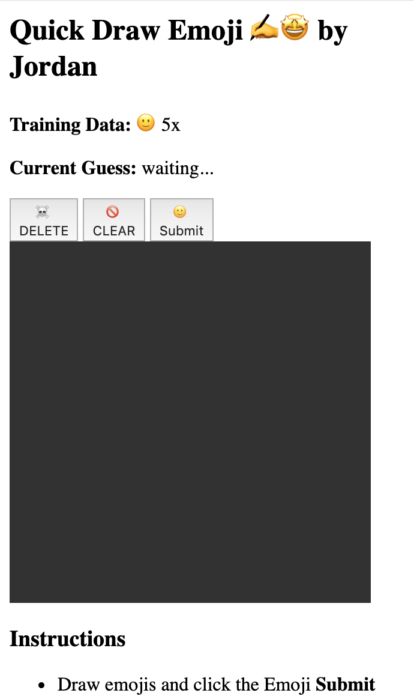

We finally have the pieces completed to be able to collect, store, format, and prepare the data for use by a Machine Learning model. Now we can start putting all that hard work to use.

For this project, we'll be using a **Decision Tree**. You don't need to fully understand how they work inside of the Machine Learning model to be able to use them, but one way to think about it is to compare it to a [flow chart for a game of 20 questions](https://amyklipp.files.wordpress.com/2017/01/flow-chart-animals.jpg?w=620).

<!-- TODO: image of decision tree -->

A decision tree / flow chart helps to quickly narrow down options and arrive at a (hopefully) correct guess.

If you take a look at the top of `model.py` you'll see that it's already using the `sklearn` library and importing the `tree` feature.

> [action]
>
> In `model.py`, return to the `### MACHINE LEARNING MODEL VARIABLES ###` section, and on a new line underneath the two training data lists, add `model = tree.DecisionTreeClassifier()`

This creates a new global variable `model` that contains a new `DecisionTreeClassifier` type of machine learning model. Right now it's just a blank new model - we still need to train it.

# Train the Model

> [action]
>
> In `model.py`, go to the `# TODO: add the update_training() function here`, and on a new line add:
>
>```python
> def update_training():
>   global model, training_features, training_labels
>   training_summary = {}
>   try:
>     model = model.fit(training_features,training_labels)
>     training_summary["tree_depth"] = int(model.get_depth());
>     training_summary["tree_leaves"] = int(model.get_n_leaves());
>
>     return training_summary
>   except:
>     return False
>```
>

First, this function accesses the global variables `model, training_features, training_labels` and creates a new dictionary `training_summary` to hold information that will be returned to update the webpage.

The most important line is `model = model.fit(training_features,training_labels)`. The `fit` function takes our two data lists of features and labels and uses it to train the model. Internally you can think of the model creating a flowchart that it can use to guess the right label.

After the model has been trained, it adds some information to `training_summary` about the **depth** and **number of leaves** of the tree - concepts we'll cover in more detail in the _Concept Review_.

## Check

Re-run the program. If you have 1 or more lines of data in `samples.txt`, the model will be trained, and you'll now see the webpage update to indicate how many training samples you have for your emoji.



With just a few more lines of code, we'll have the project start making predictions about the emoji being drawn!

Take a moment to check your code so far.

> [solution]
>
>```python
> ### IMPORT HELPERS ###
> import json
> from sklearn import tree
>
> ### CUSTOM DISPLAY VARIABLES ###
> # TODO: add global display variables here
> created_by = "Jordan"
> learn_emoji = ["🙂"]
>
> ### MACHINE LEARNING MODEL VARIABLES ###
> # TODO: add machine learning variables here
> training_features = []
> training_labels = []
> model = tree.DecisionTreeClassifier()
>
> ### DATA COLLECTION ###
> # TODO: add the save_sample(data) function here
> def save_sample(data):
>   if "label" in data.keys() and "features" in data.keys():
>     sample = {"label": data["label"], "features":data["features"]}
>     data_string = json.dumps(sample)
>     text = open("samples.txt","a+")
>     text.write(f'{data_string}\n')
>     text.close()
>     return True
>
> # TODO: add the delete_samples() function here
> def delete_samples():
>   open("samples.txt", "w").close()
>   return True
>
> # ### DATA FORMATTING ###
> # TODO: add the load_training_data() function here
> def load_training_data():
>   global training_features, training_labels
>   training_features = []
>   training_labels = []
>   sample_counts = {}
>
>   text=open("samples.txt", "r")
>   lines = text.readlines()
>   for line in lines:
>     data = json.loads(line)
>     label = data["label"]
>     features = flatten_list(data["features"])
>     training_labels.append(label)
>     training_features.append(features)
>     sample_counts[label] = sample_counts.get(label, 0) + 1
>
>   # print(sample_counts)
>   return sample_counts
>
> # TODO: add the flatten_list(list_2d) function here
> def flatten_list(list_2d):
>   flat_list = []
>   for sublist in list_2d:
>     for item in sublist:
>       flat_list.append(item)
>   return flat_list
>
> # example_list = [["a", "b", "c"],["d", "e", "f"]]
> # print(example_list)
> # print(flatten_list(example_list))
>
> #### MODEL TRAINING ###
> # TODO: add the update_training() function here
> def update_training():
>   global model, training_features, training_labels
>   training_summary = {}
>   try:
>     model = model.fit(training_features,training_labels)
>     training_summary["tree_depth"] = int(model.get_depth());
>     training_summary["tree_leaves"] = int(model.get_n_leaves());
>
>     return training_summary
>   except:
>     return False
>
> ### MODEL PREDICTION ###
> # TODO: add the predict(data) function here
>```
>

