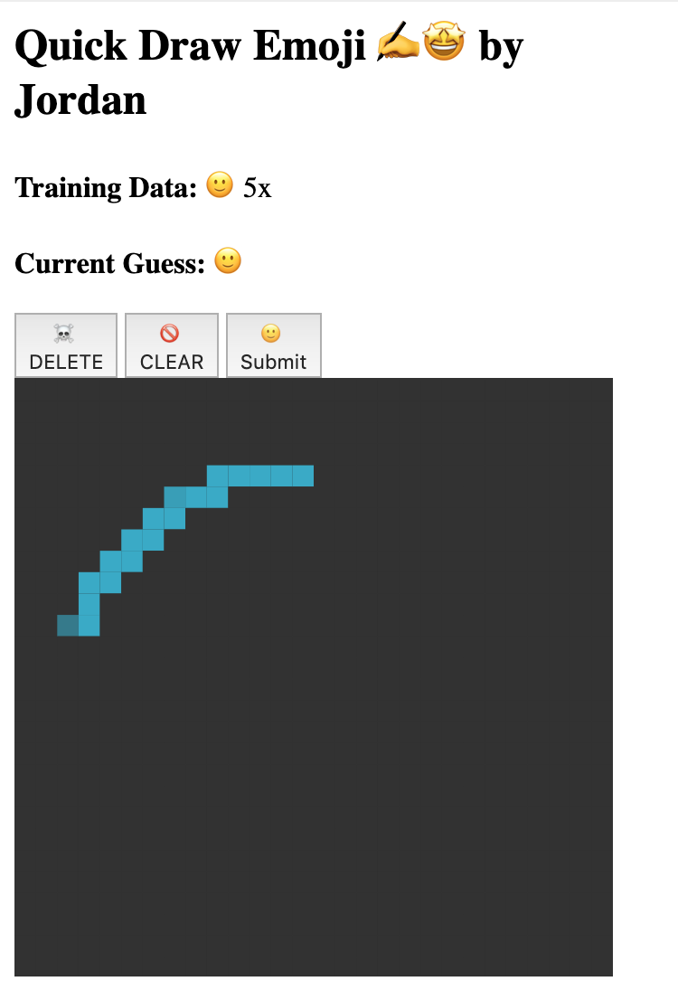
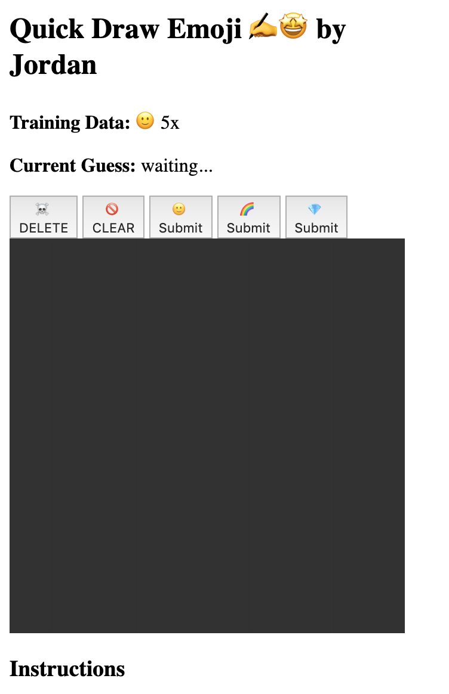
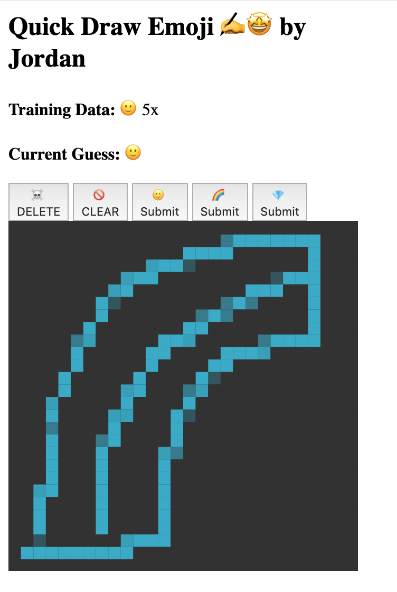
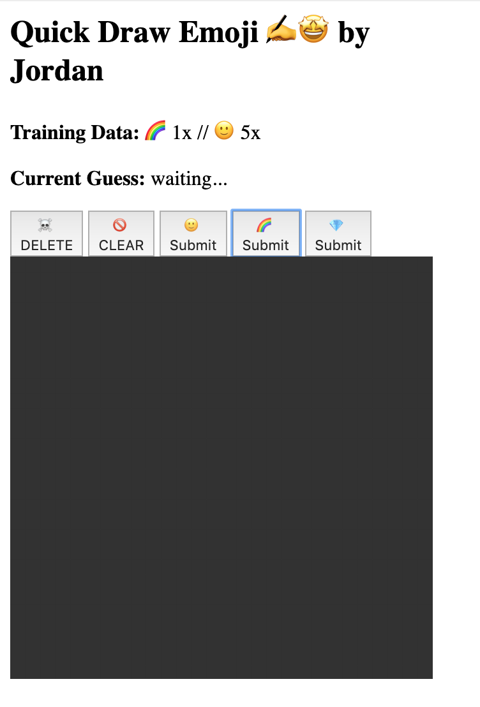
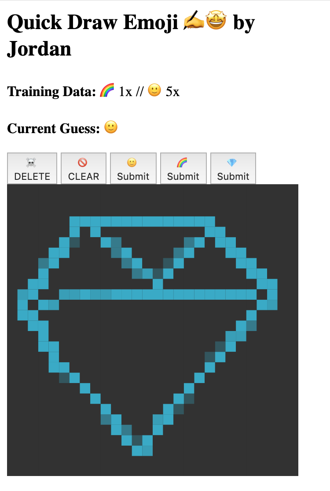

The last missing piece is to now *use* our training Machine Learning model to start making predictions about new emoji drawings.

> [action]
>
> In `model.py`, go to the `# TODO: add the predict(data) function here`, and on a new line add:
>
```python
def predict(data):
  global model
  try:
    features = flatten_list(data["features"])
    guess = model.predict([features])
    return { "guess": guess[0] }
  except:
    return None
```
>

The three important steps here are:

1. getting the feature information from the passed in data, using our `flatten_list` helper to convert it to a 1D array
1. passing in the formatted `features` to the `model.predict` function
1. saving and returning the resulting `guess` so that the webpage can display the results

## Check

Re-run the program. As long as you have 1 or more training data, when you start to draw on the canvas it will begin to make live predictions about which emoji you are drawing.



# Increase the Training Data

Did you notice that the predictions right now are 100% correct? That's because right now we are only training the model on one possible kind of emoji - so anything you draw the model will assume is that one possible label.

Now that we know all the key steps are working, it's time to add more possible emoji options.

> [action]
> In `model.py`, go back to `### CUSTOM DISPLAY VARIABLES ###`, and add more emojis to the `learn_emojis` list:
> `learn_emoji = ["🙂", "🌈", "💎"]`

## Check

Re-run the program. You should now see a separate "Submit" button for each of your emojis. Now as you draw and submit different emojis, you can start to see how the Machine Learning model performs with multiple possible options.

Adding and training new emoji:





Live predictions change as the model trains on more and more diverse sample data:



Are you feeling like a master of Machine Learning yet? 😎
