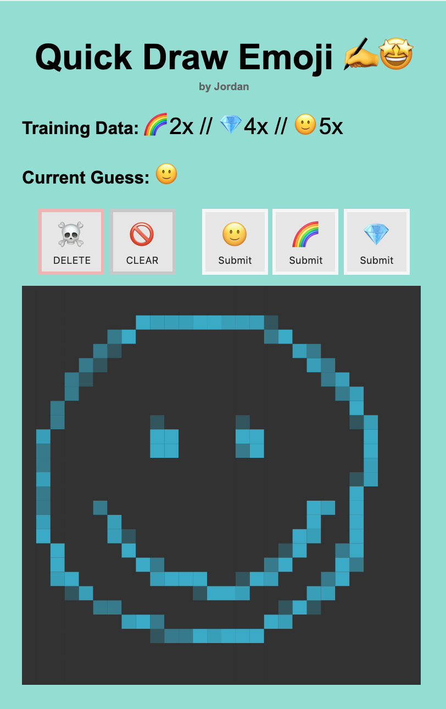

<!--  TODO-->

It's working great, now let's make it look great with some extra polish.

> [action]
> In `model.py`, go back to `### CUSTOM DISPLAY VARIABLES ###`, and `use_stylesheet = True`

Now the project will use `stylesheet.css` to apply more rules to the appearance of the webpage.

*PS - It's a stretch challenge below to further modify the CSS if you wish!*

Congratulations, you've done it! You've completed the first steps on your Machine Learning journey.

## Review

In this tutorial, you've demonstrated the fundamental building blocks of Machine Learning:

1. gathering data 📝
1. cleaning and formatting the data 🧹
1. training the model 🏋️‍♀️
1. using the trained model to make predictions 🔮

Want to view the full project solution?

> [solution]
> View at [Quick Draw Emoji Solution](https://repl.it/@MakeSchoolRAMP/QuickDrawEmojiSolution) TODO

Best of luck in your future Machine Learning adventures!

## Further Resources

These will help as you tackle the extra challenges below or head off into new programming territory to further grow your Machine Learning and overall programming skills.

- [p5.js Library Reference](https://p5js.org/reference/)
- [Jinja Templates](https://jinja.palletsprojects.com/en/2.10.x/templates/#)
- [Decision Tree Types](https://en.wikipedia.org/wiki/Decision_tree_learning#Decision_tree_types)

## Bonus Challenges

You've completed the tutorial, but can you complete more of the bonus challenges below?

# Challenge

Further customize your project's appearance by updating the CSS rules in `stylesheet.css`

# Challenge

Come up with your own totally unique customization of Quick Draw Emoji and share it with us!

Send us a link to your custom code and a short description of your changes: [Email Us](mailto:hello@makeschool.com)

We can't wait to see what you'll create! 🚀
